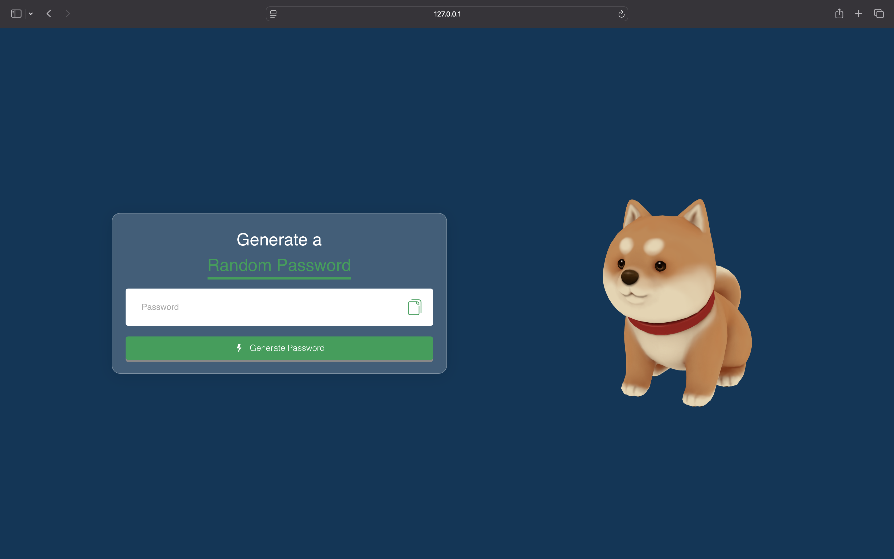

# Random Password Generator

A simple **Random Password Generator** web application built using **HTML**, **CSS**, and **JavaScript**. This app generates strong, random passwords consisting of uppercase letters, lowercase letters, numbers, and special characters. It also features a 3D rotating model for added interactivity.

## Features

- **Random Password Generation**: Generates a secure password with a mix of:
  - Uppercase letters
  - Lowercase letters
  - Numbers
  - Special characters
- **Password Copying**: One-click copy functionality to copy the generated password to the clipboard.
- **3D Model**: Interactive 3D model displayed on the page for visual appeal using the `model-viewer` element.
- **Responsive Design**: The app is fully responsive and works on all screen sizes.

## Screenshots



## How It Works

1. **Generate Password**: Click the "Generate Password" button to create a random password.
   - The password will include at least one uppercase letter, one lowercase letter, one number, and one special character.
   - The length of the password is set to 12 characters by default.
   
2. **Copy Password**: Once the password is generated, click the copy icon next to the password field to copy it to your clipboard.

3. **3D Model**: An interactive 3D model of a Shiba Inu is shown on the page. It rotates automatically and provides a fun visual experience while using the app.

## Files Included

- **index.html**: The main HTML structure for the page.
- **style.css**: The CSS file to style the page, ensuring a modern, clean design and responsiveness.
- **javascript.js**: The JavaScript that powers the password generation and copying functionality.
- **icon.png**: The icon image used for the "copy" button.
- **generate.png**: The icon image used for the "generate password" button.
- **shiba.glb**: A 3D model of a Shiba Inu used in the `model-viewer` element for visual interaction.

## How to Run

1. Clone the repository:
   ```bash
   git clone https://github.com/yourusername/random-password-generator.git
